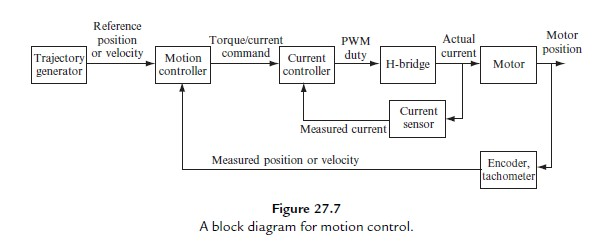
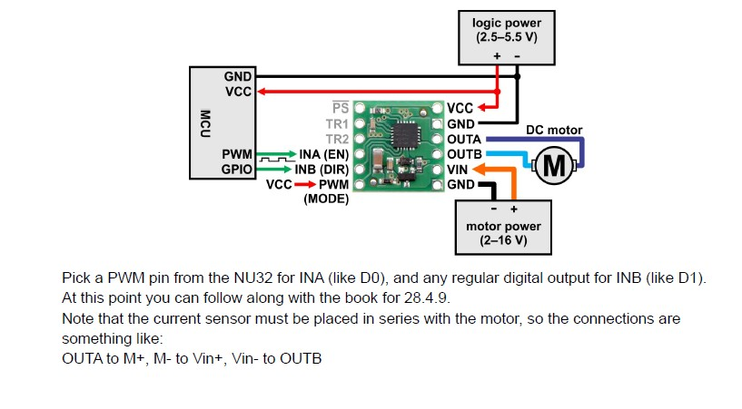

# DC Motor Control on PIC32 / NU32

An embedded C project for closed-loop position and current control of a brushed DC motor using a PIC32-based NU32 development board. The system uses a cascaded control architecture where an outer position loop generates a current reference, and an inner current loop drives the motor through PWM. This is a final project based on the course 
ME333: Introduction to Mechatronics at Northwestern University.

---

## Project Overview

This project was an attempt to implement a classic nested motor control system in embedded C on the PIC32MX795F512H (NU32 development board).

At a high level:

- The **outer position controller** computes the desired motor current based on position error.
- The **inner current controller** tracks that current reference by adjusting the PWM duty cycle sent to the H-bridge.
- A **quadrature encoder** provides position feedback.
- An **INA219 current sensor** provides measured motor current.
- A **Python client** communicates with the PIC32 over UART for testing, plotting, and gain tuning.
The implementation present in this repo only covers the inner current controller that was tested uing the ITEST mode.
---

## Hardware Stack

The system includes the following hardware components:

- **NU32 development board** using the **PIC32MX795F512H**
- **Brushed DC motor**
- **H-bridge motor driver**
- **Quadrature encoder** for motor position feedback
- **INA219 current sensor** over I2C
- **Raspberry Pi Pico** used as an intermediate encoder reader
- **Python host PC** for command/control, testing, and plotting

---

## Control Architecture

Flow of **cascaded loop**:

1. The **position controller** runs as the outer loop.
2. It generates a **reference current** based on position error.
3. The **current controller** runs as the inner loop.
4. The current loop adjusts the **PWM duty cycle** applied to the H-bridge.
5. The motor current and position are measured and fed back into the controllers.

This structure improves tracking performance and gives tighter control over motor torque/current behavior.

---




## Firmware Architecture

The firmware is organized into separate C modules for clarity and maintainability.

### Main modules

- `main.c`   
  Runs a menu-driven UART loop that listens for single-character commands from a Python client.  
  Commands can be used to:
  - read encoder values
  - set controller gains
  - run current-control tests
  - upload trajectories
  - execute tracking experiments

- `current.c`  
  Implements the **inner-loop PI current controller**, typically running at **~5 kHz** inside a timer ISR.

- `position.c`  
  Implements the **outer-loop PID position controller**, typically running at **~200 Hz** inside a slower ISR.

- `encoder.c`  
  Handles motor position feedback.  
  The encoder data is read through the **Pico**, which communicates the parsed position back to the NU32 over **UART**.

- `ina219.c`  
  I2C driver for the **INA219 current sensor**.

- `utilities.c`  
  Common helper functions and shared utilities.

---

## Python Tools

The Python scripts handle communication with the PIC32 over USB/UART and are used for testing and visualization.

### Example scripts

- `ch28.py`
- `genref.py`
- `ch28_itest_genref_example.py`
- `ch28_read_plot_matrix.py`

### Python responsibilities

- send commands to the PIC32
- upload reference trajectories
- run controller tests
- receive logged data
- plot **reference vs. actual response** for tuning and validation

---

## ITEST Workflow

The **ITEST** routine is used to validate the inner current loop.

### Workflow

1. Python sends a **square-wave current reference** to the PIC32.
2. The PIC32 runs the **PI current controller**.
3. The system logs the **measured current response**.
4. The data is sent back to Python.
5. Python plots the commanded vs. measured current.

This test is useful for tuning the current PI gains before integrating the full cascaded controller.

---

## Encoder Communication Flow

The Pico sends position data to the PIC32 over UART.

When the Pico sends a position value:

- an interrupt is generated for **each received character**
- each character is stored in `rx_message`
- once the newline character (`'\n'`) is received:
  - the numeric position is parsed using `sscanf`
  - the parsed value is stored in `pos`
  - `newPosFlag` is set to `1`

### Example usage

```c
WriteUART2("a");              // Ask for a position
while (!get_encoder_flag()){} // Wait until a new position arrives
set_encoder_flag(0);          // Clear flag so it can be used again
int pos = get_encoder_count();// Read the latest encoder count
